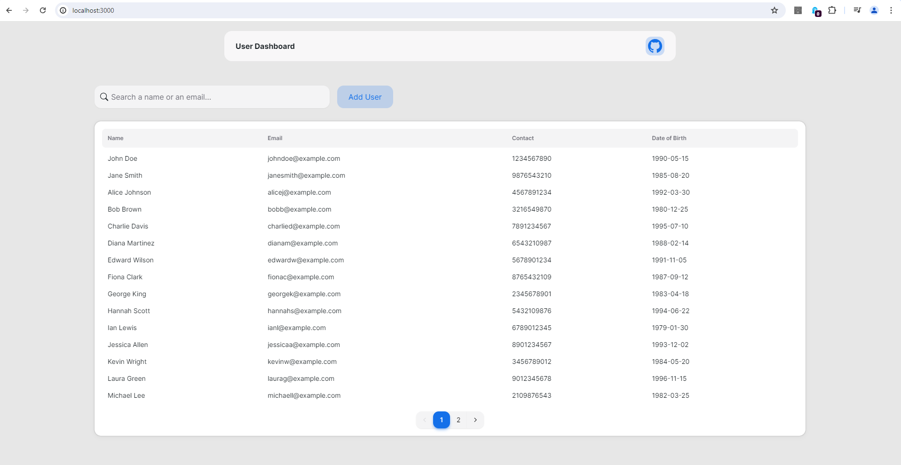

# User Dashboard

## Backend
I have implemented simple CRUD operations for user management.

I have used Node.js as javascript runtime environment, Express.js as the backend framework and MongoDB as the database.

- Available API endpoints:
    1. ``` GET /api/users?page={page}&search={search} - Get all users with pagination and search ```

    2. ``` POST /api/users - Create a new user ```

    3. ``` PUT /api/users/:id - Update user details ```

    4. ``` DELETE /api/users/:id - Delete a user ```

### Local Setup
1. Clone the repository 
2. Run ```npm install``` to install all the dependencies
3. Create a .env file in the root directory and add the following environment variables:
    ```
    mongoURI=<your_mongo_uri>
4. Run ```node index.js``` to start the server


## Frontend
The frontend is built using Next.js(React.js) and Tailwind CSS. I have utilised NextUI for the UI components. 

<strong>The frontend is a simple user dashboard where you can view, add, update and delete users. One can click on the columns to sort the users based on the column and can also search for a user.</strong>

#### Local Setup
1. Clone the repository
2. Run ```npm install``` to install all the dependencies
3. Run ```npm start``` to start the server


